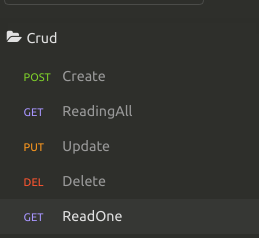

# Bem vindo ao repositório de CRUD com NodeJs + Express + MongoDb do candidato Raphael Caputo:

## Tecnologias que foram utilizadas:
* NodeJs + Express (para fazer as rotas das API)
* MongoDB (banco de dados)
* JWT (Token para autenticação que expira em 24h)
* CryptoJS (Cria uma hash que deixa o password encriptado)
 

## O que é necessário:
* NodeJs 11.x.x
* Insomnia Para testar a API [Download Aqui](https://insomnia.rest/download/)
 

## Features:  

* *EndPoint* de Registro: 
 <http://localhost:3000/auth/register>
  
* *EndPoint* de Autenticação: 
  <http://localhost:3000/auth/authenticate>
  
* *EndPoint* de Forgot Password: 
 <http://localhost:3000/auth/forgot_password>* 
  
* *EndPoint* de Reset Password: 
   <http://localhost:3000/auth/reset_password>*

 * *EndPoint* de listar todos os projeto: 
   <http://localhost:3000/projects>
  
#### para acessar as endPoint do Forgot e reset password, é necessário configuração do [mailtrap](https://mailtrap.io/inboxes)

### Para fazer o crud, é necessário estar autenticado com o token.

## Vamos registrar, e autenticar com o token que iremos gerar:
 

* Faça o clone do projeto
<code>git clone https://github.com/RaphaelCaputo2/vagas.git</code> 

* Navege ate a pasta do Projeto 
<code>cd Vagas</code> 

* Instale as dependências 
<code>npm install</code>

* Inicie o servidor 
<code>npm start</code>

## Configurando o [Insomnia](https://insomnia.rest/download/)
### Inicie o insomnia, clique em *New Workspace* e escolha o nome do seu *Workspace*

### Adicione um Ambiente base (poderá ser usado em todo o Workspace)!
#### Clique em *Manage Environments*:

#### Pronto, agora ja temos nossa base de URL preparada

### Agora vamos Organizar as pastas para nossas requisições

#### Crie duas Pastas, uma será nossa *Autenticação* e outra chamada *CRUD*

### Feito isso, agora vamos fazer nossas requisições de registro para nossa API

  

#### Vai ser feito como POST a nossa requisição

#### Feito isso, vamos a configuração da nossa requisição, nossa *BASEURL* que criamos, um pouco acima, o endpoint vai ser:
<code>*baseURL*/auth/register</code>

### Adicione as chaves *JSON* para o registro do novo usuário, e aperte *Send*

#### Virá um retorno com a chave do novo usuário.
 

### Agora iremos autenticar esse usuário, que também será uma requisição POST.

#### Coloque o email e senha que você, acabou de criar!

 ##### O endpoint será:

<code>baseurl/auth/authenticate</code>

#### Irá retornar um token, Copie ele:
 

### Vamos criar uma nova chave, para o objeto no *Environments* (Onde criamos a BASEURL)

  

### Agora iremos criar uma nova pasta, para fazermos as requisições do *CRUD*

#### A pasta vai se chamar CRUD, e terá essa organização. <strong>ATENÇÂO</strong>
se atente as configurações das requisições da API:

### Agora iniciaremos as requisições do CRUD(Nessa parte, iremos usar a chave token, que criamos):

#### E a base de endereço de nossas requisições é:

<code>baseUrl/projects</code>

### O primeiro sera o CREATE

#### vamos configurar a autorização, clique em AUTH e depois em Bearer TOKEN

#### E depois clique em BODY e em JSON, depois preencha do jeito que achar melhor, e aperte SEND:

### Agora vamos listar os projetos:

#### E seguiremos essa configuração no HEADER, e com essa BASE de URL!

<strong>Para requisitar somente um projeto, você pode usar o ID do projeto/usuário,para fazer a requisição</strong>

<i>
  <code>baseUrl/projects/ID</code>
</i>

### Agora vamos fazer o UPDATE

#### Configurando a autorização(lembre-se, o ID do projeto é necessário):

 

#### Fazendo o update:

### Agora vamos fazer, o DELETE (necessário também o ID do projeto/usuario):

Configure, e logo depois aperte SEND :

Lembrete: Na aba *Header* voce coloca <i>Authorization</i>, <i>bearer + o token</i> que copiamos no *Environments* 

 

## Recuperando e resetando a senha!

### Para resetar e recuperar a sennha é necessário cadastro no [mailTrap](https://mailtrap.io/inboxes), iremos usar esse serviço para simular uma recuperação, pois ele simula uma caixa de email!

 Entre no link (https://mailtrap.io/inboxes), e cadastre-se, assim que terminar o cadastro,
vá na aba de configurações
 
Selecione <i>Nodemailer</i>
 
Copie a váriavel.

 Agora voltamos ao vsCode ou seu editor de preferência, vá no arquivo
<code>src/config/mail.json</code>
Apague o JSON que esta la, e cole o que voce copiou. Pronto, agora ja configuramos a porta, usuario e password para enviar o email de recuperação.

#### Voltamos ao Insomnia para fazer as requisições

Primeiro, iremos fazer duas requisições a API com o método POST

Depois criar o endpoint e qual email queremos, o endpoint sera
<code>baseUrl/auth/forgot_password</code>
O email pode ser algum que voce criou no começo, ele precisa estar no banco de dados,
pois assim iremos resetar somente a senha.

Agora iremos la no mailTrap ver nosso "inbox", la iremos encontrar o token que irá resetar nossa senha

Copie somente o <i>token</i>
 

 
Com o token em mãos, vamos agora resetar a senha no insomnia
 o endpoint para fazer o reset é: 
 <code>baseUrl/auth/reset_password</code>
 Ficará assim:

 
 

 
Depois iremos autenticar a nova senha: 
 no endPoint:

 <code>baseUrl/auth/authenticate</code>

 

